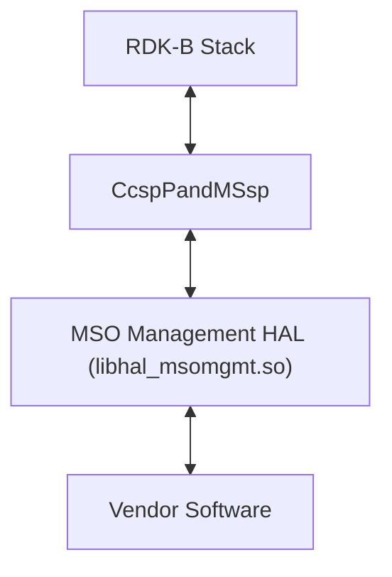
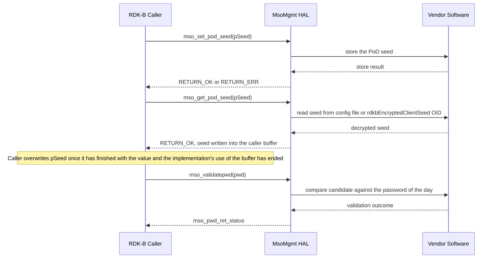

# MsoMgmt HAL Documentation

## Version History

| Date | Comment | Version |
| --- | --- | --- |
| 2024-06-10 | Initial release. MSO HAL header migration to GitHub (RDKB-52500), refined against MTA HAL review comments. | 1.0.0 |
| 2026-08-24 | Specification rebuilt against `include/mso_mgmt_hal.h`. A previously documented initialization and teardown lifecycle, its context handle type, and a device-status call were removed: this interface has never declared any of them. Canonical topic set completed. | Unreleased |

**Provenance of this page.** It was renamed from `docs/pages/MsoMgmtHalSpec.md` to the canonical `docs/pages/` specification page in the same change that rewrote it against the canonical topic set. Git records a rename only where the two versions still resemble each other, and a full rewrite does not, so a `--follow` listing of the canonical path begins at that change, and the revisions before it are reached by listing the legacy path instead:

```sh
git log --follow -- docs/pages/halSpec.md
git log --follow -M1% -- docs/pages/halSpec.md
git log -- docs/pages/MsoMgmtHalSpec.md
```

That resemblance is measured, and the threshold is 50% by default, so lowering it to git's floor with the second command above is worth trying first: where it pairs the two paths it shows both stretches of history in one listing, and where the rewrite kept too little of the original for git to pair them at any threshold the third command remains the only route to the earlier revisions.

Four version identities apply to this repository and are deliberately kept apart, because conflating them misrepresents the interface:

- **Release tag** \- `1.0.0`, the only tag in this repository, and the release the table above describes.
- **Document revision** \- the rows of the table above. The `Unreleased` row is this documentation change, which has not been cut into a release.
- **Generated-site version string** \- `docs/generate_docs.sh` derives `PROJECT_VERSION` from `git describe --tags` and passes it verbatim to the documentation generator, so the title of the generated site carries a string of the form `<tag>-<commits-since-tag>-g<abbreviated-commit>`: the `1.0.0` tag, the number of commits made since it, and an abbreviated commit hash. **No literal value for it is recorded here, because it advances with every commit** \- any value written into this document would be wrong from the next commit onward, and a stale one invites a reader to mistake a build coordinate for a release. It is a build identifier and not a version of either the interface or this document. A reader comparing two generated sites compares the tag portion and treats the suffix as a build coordinate.
- **Interface version** \- **none exists.** This header defines no version macro, so a caller cannot query the interface version at compile time or at runtime. See `Variability Management`.

*Derived from the repository-root changelog (single `1.0.0` section, which carries no per-release date), the `1.0.0` tag's commit date, and `docs/generate_docs.sh`.*

## Acronyms

- `HAL` \- Hardware Abstraction Layer
- `RDK-B` \- Reference Design Kit for Broadband Devices
- `MSO` \- Multiple System Operator
- `PoD` \- Password of the Day
- `API` \- Application Programming Interface
- `ABI` \- Application Binary Interface
- `OEM` \- Original Equipment Manufacturer
- `DOCSIS` \- Data Over Cable Service Interface Specification
- `SNMP` \- Simple Network Management Protocol
- `OID` \- Object Identifier
- `SLA` \- Service Level Agreement

*Bounded to the terms this document uses.*

## Description

The diagram below describes the high-level software architecture of the MsoMgmt HAL module stack.



The MSO Management HAL is the interface through which RDK-B middleware validates an operator's **password of the day** and manages the **PoD seed** from which that password is derived. The `OEM` or third-party vendor supplies the implementation behind the interface; RDK-B supplies the caller. The owning middleware service is `CcspPandMSsp`.

The declared contract is exactly three functions: one password validation call and two seed accessors. They are listed by identifier under `API Surface`.

**What this interface does not cover.** The header's file-level description frames the deployment context as broadband `DOCSIS` devices in `MSO` environments (`include/mso_mgmt_hal.h:22-30`) and then states its own scope limit: the interface states that "no declaration here provisions a device, reads or writes a data model, delivers an event notification, or performs any security operation other than validating a candidate password" (`:40-43`). That statement replaced an earlier description which had listed device provisioning and configuration, data-model read and write access, event notification and security management as capabilities of this HAL. **No declaration in this header implements any of those**, and the earlier wording was the single largest inaccuracy in this repository's documentation. A caller must take the three declarations as the whole of the contract and must not plan against the broader wording.

*Derived from `include/mso_mgmt_hal.h:22-53, 382, 499, 615` for the interface, and line 97 of the superproject README for the owning service.*

## Optional Components

The following are optional and at the vendor's discretion.

- `rdkbEncryptedClientSeed` — `mso_get_pod_seed` is documented as retrieving the seed in decrypted form "either from the device configuration file or from the rdkbEncryptedClientSeed SNMP OID" — the header's own words (`include/mso_mgmt_hal.h:505-506`). Either source satisfies the contract; the interface does not select between them, and a caller cannot determine from the return value which one was used.
- On-demand seed decryption — `mso_set_pod_seed` records that "on newer broadband devices the implementation is required to decrypt the seed on demand when this function is called" (`:392-394`). Whether decryption happens on demand is therefore a device-class-dependent implementation behavior rather than a property of every conforming implementation, and the header states that the interface gives a caller no way to determine which behavior it has.

The interface declares **no optional functions**. All three declarations (`:382`, `:499`, `:615`) are unconditional, with no build-variability guard around any of them, so a conforming implementation exposes all three on every product.

*Derived from `include/mso_mgmt_hal.h:456-460, 489-492` and the unconditional declarations at `:382`, `:499`, `:615`.*

## Component Runtime Execution Requirements

### Initialization and Startup

**This interface has no initialization or de-initialization entry point and no context handle.** A caller invokes any of the three functions directly, in any order, without opening or closing a session. That is stated affirmatively here because its absence is easy to mistake for an undocumented lifecycle: there is no call to make first, and nothing to release afterwards.

The MsoMgmt HAL client module does not have explicit dependencies on other APIs.

The three functions available to a caller are:

- `mso_validatepwd()`
- `mso_set_pod_seed()`
- `mso_get_pod_seed()`

Third-party vendors must implement this HAL according to their system's specific requirements.

The interface specifies no startup ordering, no readiness handshake and no behavior for a call made before the vendor implementation is ready. A caller must not assume that any of the three functions is safe to call at an arbitrary point in the boot sequence, and must not assume that it is unsafe either — this interface does not establish it.

*Derived from `include/mso_mgmt_hal.h:382, 484, 580`, and from the dependency and vendor-implementation statements carried by the previous revision of this page.*

### Threading Model

**There is no requirement to make this interface thread safe.** Any module that invokes the API must ensure calls are made in a thread-safe manner. This differs deliberately from HALs that declare themselves thread safe; the obligation to synchronize rests with the caller.

Vendors may implement internal threading and event mechanisms to meet their operational requirements. These mechanisms must be designed to ensure thread safety when interacting with the HAL interface. Proper cleanup of allocated resources (memory, file handles, threads) is mandatory when the vendor software terminates or closes its connection to the HAL.

*Derived from the threading statement carried by the previous revision of this page, which is this repository's own policy statement.*

### Process Model

All APIs are expected to be called from multiple processes. Due to this concurrent access, vendors must implement protection mechanisms within their API implementations to handle multiple processes calling the same API simultaneously. This is crucial to ensure data integrity, prevent race conditions, and maintain the overall stability and reliability of the system.

*Derived from the process-model statement carried by the previous revision of this page.*

### Memory Model

Every buffer this interface touches is supplied by the caller. No declared function returns a pointer, so the HAL hands back no storage for a caller to free and there is no ownership transfer in either direction.

#### Caller Responsibilities

- Manage memory passed to specific functions as outlined in the API documentation, including allocation and deallocation, to prevent leaks.
- **All three parameters are caller-allocated.** `pwd` is a "Caller-allocated candidate password to validate; the caller allocates the buffer, owns it and releases it" (`include/mso_mgmt_hal.h:274-275`); the `pSeed` argument of `mso_set_pod_seed` is a caller-allocated buffer the implementation reads (`:397-398`); the `pSeed` argument of `mso_get_pod_seed` is a caller-allocated buffer the implementation writes into (`:514-515`).
- **Both seed buffers must be at least 64 bytes** (`:398`, `:514`).
- After `mso_get_pod_seed` returns, the caller's buffer holds a **decrypted secret**, which this interface "requires it to erase once it has used it", on the failure path as much as on the success path because it does not state whether the implementation wrote anything before failing (`:552-558`). Two kinds of storage are involved, and clearing one does not clear the other: "erasing the caller's copy does not erase whatever copy the implementation holds; this interface provides no call that does" (`:594-596`). The interface states the obligation without establishing a point at which discharging it is safe - whether the implementation retains `pSeed` beyond the call is unspecified, and no wipe, release or completion call is declared - so a caller obtains that guarantee from the implementation it runs against rather than from this header (`:597-611`). `Logging and debugging requirements` states the same discipline.
- **The interface does not specify whether these buffers are NUL-terminated or fixed-length**, and does not state how a caller determines the length of a seed it has just retrieved. A caller must not assume either representation.

#### Module Responsibilities

- Handle and deallocate memory used for internal operations.
- Release all internally allocated memory upon closure to prevent leaks.
- The interface does not state whether an implementation may retain a caller-supplied pointer beyond the duration of the call, so a caller cannot rely on the buffer becoming private again on return. **This is the interface's position wherever retention is mentioned in this document**, including under `Logging and debugging requirements`: not retaining a caller-supplied pointer is an obligation this specification places on an implementation, and it is not a guarantee the interface makes or lets a caller verify. A caller therefore keeps each buffer under its own control, does not release the memory to a general-purpose allocator and does not reuse the buffer for unrelated data, and overwrites the value in place once the implementation's use of that buffer has ended rather than at the moment it has itself finished with it — the sequencing set out under `Logging and debugging requirements`, which is what keeps an erasure from landing in a read the implementation may still be performing.

**No memory footprint limit is specified for this interface.** Neither the header nor any other artifact in this repository states a maximum resident size for an implementation, so none is asserted here.

*Derived from `include/mso_mgmt_hal.h:274-293, 397-429, 514-539`, and from the caller/module split carried by the previous revision of this page.*

### Power Management Requirements

The HAL is not involved in any of the power management operations.

*Derived from the power-management statement carried by the previous revision of this page.*

### Asynchronous Notification Model

There are no asynchronous notifications. The header corroborates this: it declares no callback typedef and no registration function, so there is no notification surface for a caller to subscribe to and no delivery thread to reason about.

*Derived from `include/mso_mgmt_hal.h` (no callback typedef declared) and the notification statement carried by the previous revision of this page.*

### Blocking calls

**Synchronous and Responsive:** All APIs within this module should operate synchronously and complete within a reasonable timeframe based on the complexity of the operation.

**Timeout Handling:** To ensure resilience in cases of unresponsiveness, vendors should implement appropriate timeouts within their implementations where failure due to lack of response is a possibility.

**Blocking behavior is not specified.** This interface does not specify whether `mso_validatepwd`, `mso_set_pod_seed` or `mso_get_pod_seed` may block; a caller must not assume either behavior. This is recorded as unspecified rather than resolved because the previous revision of this page asserted both positions — under its implementer note, that the interface "is designed to block execution if the necessary hardware is not yet ready", and under this topic, that "it is imperative that they do not block or suspend execution of the main thread" — and nothing in the header establishes either. A caller that must not block should treat these calls as potentially blocking and isolate them accordingly.

**No per-API response-time budget or timeout value is specified for this interface.** No maximum response time, no default timeout and no configuration option for one is stated by the header or by any other artifact in this repository.

*Derived from `include/mso_mgmt_hal.h:382, 484, 580` (which state no blocking or timing behavior) and from the contradictory statements carried by the previous revision of this page.*

### Internal Error Handling

**Synchronous Error Handling:** All APIs must return errors synchronously as a return value. This ensures immediate notification of errors to the caller.

**Internal Error Reporting:** The HAL is responsible for reporting any internal system errors, such as out-of-memory conditions, through the return value.

**Focus on Logging for Errors:** For system errors, the HAL should prioritize logging the error details for further investigation and resolution. **Those details never include the candidate password or the seed.** A failure of any of these three calls is logged by naming the operation and the outcome, never by recording the value that was rejected or could not be decrypted; see `Logging and debugging requirements`.

The interface provides exactly two error domains and no others: `mso_pwd_ret_status` for `mso_validatepwd`, and the `RETURN_OK` / `RETURN_ERR` integer pair for both seed accessors. There is no error-detail accessor, no `errno` convention and no way for a caller to distinguish the failure causes the header groups behind a single `RETURN_ERR` — `mso_set_pod_seed` documents an invalid seed and a decryption error (`include/mso_mgmt_hal.h:384-499`) and `mso_get_pod_seed` documents a retrieval error and a decryption error (`:501-615`) against that one value, and the header says so explicitly on each declaration: the caller cannot tell them apart.

*Derived from `include/mso_mgmt_hal.h:133, 137, 186-195, 318-337, 448-456, 562-571` and the error-handling statements carried by the previous revision of this page.*

### Persistence Model

There is no requirement for the HAL to persist any setting information.

Note that `mso_get_pod_seed` is documented as retrieving the seed from the device's configuration file or the `rdkbEncryptedClientSeed` `SNMP` `OID` (`include/mso_mgmt_hal.h:501-615`), so a seed does live somewhere on the device. Where it is stored, and whether a seed written by `mso_set_pod_seed` survives a restart, is a vendor implementation matter this interface does not specify.

*Derived from `include/mso_mgmt_hal.h:504-507` and the persistence statement carried by the previous revision of this page.*

## Non functional requirements

The following non functional requirements should be supported by the component.

### Logging and debugging requirements

The component is required to record all errors and critical informative messages to aid in identifying, debugging, and understanding the functional flow of the system. Logging should be implemented using the syslog method, as it provides robust logging capabilities suited for system-level software. The use of `printf` is discouraged unless `syslog` is not available.

All HAL components must adhere to a consistent logging process. When logging is necessary, it should be performed into the `mso_vendor_hal.log` file, which is located in either the `/var/tmp/` or `/rdklogs/logs/` directories.

Logs must be categorized according to the following log levels, as defined by the Linux standard logging system, listed here in descending order of severity:

- **FATAL:** Critical conditions, typically indicating system crashes or severe failures that require immediate attention.
- **ERROR:** Non-fatal error conditions that nonetheless significantly impede normal operation.
- **WARNING:** Potentially harmful situations that do not yet represent errors.
- **NOTICE:** Important but not error-level events.
- **INFO:** General informational messages that highlight system operations.
- **DEBUG:** Detailed information typically useful only when diagnosing problems.
- **TRACE:** Very fine-grained logging to trace the internal flow of the system.

Each log entry should include a timestamp, the log level, and a message describing the event or condition. This standard format will facilitate easier parsing and analysis of log files across different vendors and components.

**Handling of secret values in log and debug output.** Two kinds of value cross this interface and only one of them is secret. **The secret class is exactly three buffers:** the candidate password `mso_validatepwd` reads through `pwd`, the seed `mso_set_pod_seed` reads through `pSeed`, and the decrypted seed `mso_get_pod_seed` writes into the caller's `pSeed` buffer. All three carry credential material, and the seed is the input from which every day's operator password is derived, so its disclosure compromises not one password but all of them. **Everything else these three calls produce is not secret and may be logged:** the `mso_pwd_ret_status` verdict `mso_validatepwd` returns — `Good_PWD`, `Invalid_PWD`, `Unique_PWD`, `Expired_PWD` and `TimeError` alike — the `RETURN_OK` or `RETURN_ERR` status the two seed accessors return, the identity of the operation that produced either, and the timestamp and log level the format above requires. A verdict is an outcome *about* a value and not the value itself, which is why `Internal Error Handling` requires a failure to be recorded by naming the operation and its outcome: that record is not a disclosure. The requirements below govern the secret class alone. They are normative for this interface, and they bind the vendor implementation and the RDK-B caller equally. They are stated here because the interface declares no redaction helper and no secure-buffer type, so nothing enforces them mechanically; the header states the same division of the two classes on the interface itself (`include/mso_mgmt_hal.h:359-361`, `:475-477` and `:588-596`).

- **No secret, and no part of one, is written to log output at any severity.** Neither an implementation nor a caller may write a candidate password, a `PoD` seed, or any fragment, prefix, suffix, character count, length, hash or digest of either — plaintext, encrypted, encoded, hashed, truncated or counted — to `mso_vendor_hal.log`, to `syslog`, to standard output, to standard error, to a trace or an execution trace, to an exception or error message, or to any other diagnostic stream. This applies at every level in the ladder above, `DEBUG` and `TRACE` included: a value that is too sensitive for `INFO` is not made acceptable by lowering the severity, and a build that enables verbose logging must not become a build that discloses credentials. A hash is not an exemption — the candidate space for a password of the day is small enough to enumerate — and a length is not one either, because it narrows a search.
- **A message that must refer to a secret names the item and substitutes one fixed marker.** Where a diagnostic has to identify what it was operating on, it records the operation, the outcome and the parameter's name — for example that `mso_set_pod_seed` rejected the seed it was given — and never the value. **The marker is the single fixed literal `[REDACTED]`**, used for every protected value in this interface: the same marker whichever value it stands for, independent of that value and of its length, so that nothing about the value can be inferred from the log. No prefix, no suffix, no first or last character, no character count and no digest may be substituted for it or appended to it.
- **A rejected password is not logged.** A validation failure is the case most likely to prompt an implementer to log the offending input for diagnosis, and it is the case where doing so is most damaging: a failed candidate is frequently a valid credential for another device, another day or another account. The verdict is logged; the candidate is not.
- **Secrets are excluded from crash artefacts, from support bundles and from telemetry, and that is a separate obligation.** A core dump, a minidump, a heap dump, a stack dump, a stack trace, an exception report or a support bundle must not carry a candidate password or a `PoD` seed, whole or in fragment, hashed or reduced to a length; and neither may any telemetry, analytics, metric, metric label or usage report. This obligation fails separately from the logging one: an implementation with impeccable log discipline still discloses everything if an unfiltered core file or a support bundle is collected and uploaded. Where a platform's crash handler cannot be constrained, the value must not be resident at the moment an artefact can be taken — which is what the clearing rule below achieves, as early as its sequencing safely permits. Where retention is unresolved that window cannot be closed on return, which is why the rule requires the retention question to be settled with the implementer rather than answered by an early overwrite.
- **Caller-side buffers holding a secret are cleared, and the order is part of the requirement.** Two kinds of storage hold these values and they are not erased at the same moment, so stating only "clear after use" would tell a caller to do something this interface makes unsafe.
  - **A copy the caller itself made is the caller's own storage.** No part of this interface holds a pointer to it, so the caller overwrites each copy as soon as it has finished with that copy, on every path including the failure path. This case is unconditional, and it is the one a caller should prefer: a caller that needs a seed or a candidate for longer than the supplied buffer can safely hold it takes its own copy, works from the copy, and erases the copy.
  - **A buffer the caller passed to a call, or supplied for a call to write into, is storage whose retention this interface does not settle.** None of the three declarations states a lifetime for its argument, so the caller overwrites such a buffer once the implementation's use of it has ended — and immediately once it has. That point is the return of the call where non-retention has been established by inspection of the implementation or by contract with the vendor, and it is the release or completion that ends the use where the implementation is known to hold the pointer for longer.
  - **Overwriting a passed or supplied buffer on return, while retention is still unresolved, is not the conservative reading of this rule.** If the implementation does hold the pointer, the overwrite lands in a read or a write it is still performing: the `pwd` buffer changes under the validation, the `pSeed` buffer changes under the seed installation, and a caller that followed the security rule literally has introduced the corruption the rule exists to prevent. Until retention is settled the caller keeps the allocation dedicated to that value — not released to a general-purpose allocator, not reused for unrelated data, not handed to another component — and settles the question with the implementer as part of integrating it, rather than leaving the value resident indefinitely or clearing it early.
  - The failure path is included on both terms above, because a failed retrieval or a failed decryption may have left part of a value in the buffer; a copy is as disclosing as the original.
  - `mso_get_pod_seed` states the same sequencing on its own declaration: the interface "requires it to erase once it has used it" and applies "the same erasure obligation ... on the failure path as on the success path" (`include/mso_mgmt_hal.h:552-558`). The identical discipline applies to the seed a caller passes to `mso_set_pod_seed` and to the candidate it passes to `mso_validatepwd`, and each declaration restates it.
- **A secret is not carried anywhere it would outlive the call.** A retrieved seed is not copied into a data model, a message, a configuration file, a cache, an environment variable or a longer-lived allocation, and is not passed to a component that has no need of it. An implementation is likewise required not to retain a caller-supplied pointer past the return of the call — but that is a requirement placed on the implementation, not something this interface establishes or reports: as `Memory Model` states, the retention lifetime of a caller-supplied buffer is unspecified here, so a caller keeps its buffers under its own control and clears them in place on the sequencing above, rather than assuming they became private on return.
- **The interface itself guarantees none of this.** It declares no scrubbing function, no opaque credential type and no flag by which a caller could ask an implementation to suppress logging, and it provides no way for a caller to verify that an implementation observes these rules. A caller integrating a vendor implementation must therefore establish compliance by inspection or by contract rather than assume it, and must treat the absence of secrets from a vendor log as unverified until it has done so.

*Derived from `include/mso_mgmt_hal.h:552-561` (the caller's stated erasure obligation), `:359-361`, `:475-477` and `:588-596` (the statement of which values are secret and where the secret class may not appear, restated on each declaration), `:362-377`, `:478-495` and `:597-611` (the erasure sequencing restated on each declaration), and `:274-293` and `:514-539` (the two secret-bearing buffers), and from the logging requirements carried by the previous revision of this page.*

### Memory and performance requirements

**Client Module Responsibility:** The client module using the HAL is responsible for allocating and deallocating memory for any data structures required by the HAL's APIs. This includes buffers used to receive data from the HAL — for this interface, the seed buffer described under `Memory Model`.

**Vendor Implementation Responsibility:** Third-party vendors, when implementing the HAL, may allocate memory internally for their specific operational needs. It is the vendor's sole responsibility to manage and deallocate this internally allocated memory.

Neither a memory footprint limit nor a performance budget is specified for this interface; see `Memory Model` and `Blocking calls` respectively.

*Derived from the memory and performance statements carried by the previous revision of this page.*

### Quality Control

To ensure the highest quality and reliability, it is strongly recommended that third-party quality assurance tools such as `Coverity`, `Black Duck` and `Valgrind` be employed to thoroughly analyze the implementation. The goal is to detect and resolve potential issues such as memory leaks, memory corruption, or other defects before deployment.

Furthermore, both the HAL wrapper and any third-party software interacting with it must prioritize robust memory management practices. This includes meticulous allocation, deallocation, and error handling to guarantee a stable and leak-free operation. The decrypted seed `mso_get_pod_seed` writes into a caller buffer (`include/mso_mgmt_hal.h:501-615`) makes this more than a hygiene matter: a leaked or un-overwritten buffer leaks a credential.

**Keeping this document accurate.** Every topic above and below names the file its content was derived from. **Any change to a file this document cites obliges a review of the topics that cite it** — in practice, any change to `include/mso_mgmt_hal.h` obliges a review of `Optional Components`, `Memory Model`, `Internal Error Handling`, `Theory of operation and key concepts`, `Data Structures and Defines`, `API Surface`, `Sequence Diagram` and `State Diagram`. The responsible reviewer is this repository's code owner, `@rdkcentral/rdkb-hal-advisory` (`.github/CODEOWNERS`).

*Derived from the quality-control statements carried by the previous revision of this page, `.github/CODEOWNERS`, and `include/mso_mgmt_hal.h:552-561`.*

### Licensing

The implementation is expected to be released under the Apache License 2.0, which is the license the interface header itself carries (`include/mso_mgmt_hal.h:1-18`).

*Derived from `include/mso_mgmt_hal.h:1-18` and the licensing statement carried by the previous revision of this page.*

### Build Requirements

The source code should be capable of, but not be limited to, building under the Yocto distribution environment. The recipe should deliver a shared library named `libhal_msomgmt.so`.

*Derived from the build statement carried by the previous revision of this page.*

### Variability Management

The role of adjusting the interface, guided by versioning, rests solely within architecture requirements. Thereafter, vendors are obliged to align their implementation with a designated version of the interface. As per `SLA` terms, they may transition to newer versions based on demand needs.

Each API interface will be versioned using [Semantic Versioning 2.0.0](https://semver.org/spec/v2.0.0.html); the vendor code will comply with a specific version of the interface.

Two facts about this particular interface qualify that governance, and both are stated plainly rather than left to inference:

- **The header defines no compile-time variability flag.** There is no feature macro that adds, removes or alters a declaration or a type; every declaration is unconditional. A vendor cannot present a reduced surface and remain conformant.
- **The header defines no version macro.** Unlike HALs that publish major and minor version macros, this one publishes none, so a caller cannot query the interface version at compile time or at runtime, and cannot guard code against an interface revision. Version alignment is therefore an integration-time agreement rather than something the interface enforces.

*Derived from `include/mso_mgmt_hal.h` (no feature or version macro is defined) and the versioning statements carried by the previous revision of this page.*

### Platform or Product Customization

This interface exposes no product- or platform-conditional surface. No compile flag excludes any declaration, macro or type, so a conforming implementation presents the same three functions with the same signatures on every product.

The one variation the interface does record is implementation-side and invisible to a caller: the seed may be held in a configuration file or behind the `rdkbEncryptedClientSeed` `SNMP` `OID` (`include/mso_mgmt_hal.h:505-507`), and newer broadband devices are required to decrypt it on demand when `mso_set_pod_seed` is called (`:392-394`). Which applies is a vendor and device-class matter that this interface does not constrain and does not report.

*Derived from `include/mso_mgmt_hal.h:456-460, 489-492` and the unconditional declarations at `:382`, `:499`, `:615`.*

## Interface API Documentation

All HAL function prototypes and datatype definitions are available in the `mso_mgmt_hal.h` file.

1. Components/Processes must include `mso_mgmt_hal.h` to make use of MsoMgmt HAL capabilities.
2. Components/Processes should add a linker dependency for `libhal_msomgmt.so`.

Per-API detail — argument ranges, pre-conditions, every return value and the reason for it — is carried by the inline documentation on each declaration in that header, and is not duplicated here.

*Derived from `include/mso_mgmt_hal.h` and the include-and-link direction carried by the previous revision of this page.*

### Theory of operation and key concepts

This interface exists so that RDK-B middleware can answer one question and maintain the input to it. The question is whether a password offered to the device matches the operator's password of the day; the input is the `PoD` seed from which that day's password is derived.

Two concepts carry the whole contract:

- **Password of the day** — a credential that is valid for the current day. `mso_validatepwd` "compares the value the caller supplies with the password that is valid for the MSO user for the current day, and returns a verdict" (`include/mso_mgmt_hal.h:268-269`). The interface exposes no way to read or generate the password itself; a caller can only submit a candidate and receive a verdict.
- `PoD` seed — the value from which the daily password is generated. `mso_set_pod_seed` "configures the seed value from which the daily password for MSO users is generated" (`:387`), and `mso_get_pod_seed` "reads the PoD seed and writes it, decrypted, into the buffer the caller supplies" (`:504`). The derivation function itself is not part of this interface.

The interface is a value-passing boundary, not an object model: three calls, caller-owned buffers, and a status per call.

Both concepts are credentials, and that shapes how a caller handles them rather than only how it calls them. A password of the day is a credential for one day; the `PoD` seed is the input every day's password is derived from, so disclosing the seed discloses more than disclosing a password does. Neither value may be logged, traced or copied anywhere it would outlive the call, and the caller's buffer is cleared once it has finished with the value and the implementation's use of that buffer has ended — see `Logging and debugging requirements` for the full requirement and its sequencing, and `Memory Model` for the buffer obligations it rests on.

*Derived from `include/mso_mgmt_hal.h:308-315, 401-407, 486-492`.*

#### Object Lifecycles

**There are no objects and no handles.** This interface declares no context type, no opaque pointer, no create or destroy call and no instance identifier. Nothing is opened before use and nothing is released afterwards, so there is no lifecycle for a caller to manage and no leak for a caller to cause by omission.

The caller owns every buffer that crosses the boundary and is responsible for its allocation, its lifetime and — for the seed buffer — its erasure on the sequencing that declaration states (`include/mso_mgmt_hal.h:552-561`). The HAL owns nothing on the caller's behalf.

*Derived from `include/mso_mgmt_hal.h:39-40, 382, 499, 615` (no context type or lifecycle call is declared).*

#### Method Sequencing

The seed underpins derivation of the password of the day: `mso_set_pod_seed` "configures the seed value from which the daily password for MSO users is generated" (`include/mso_mgmt_hal.h:387`) and `mso_validatepwd` matches a candidate against "the password that is valid for the MSO user for the current day" (`:268-269`). Read together, those two statements establish a logical relationship — a seed has to be in place for a validation to succeed against a password derived from it.

That relationship is logical, not mandated, and the distinction matters to a caller:

- **The interface requires no call order.** None of the three declarations states a pre-condition on another.
- **The interface defines no initialization**, so there is no first call to make.
- **The interface does not specify the behavior of `mso_validatepwd` when no seed has been set** — not which status it returns, and not whether the call is valid at all.
- `mso_set_pod_seed` and `mso_get_pod_seed` are not documented as a matched pair. Nothing states that a seed written by the setter is the seed returned by the getter, and the getter names its own sources independently (`:505-507`).

A caller must therefore sequence calls according to its own requirements and treat any assumption beyond the above as unestablished.

*Derived from `include/mso_mgmt_hal.h:308-315, 401-407, 486-492`.*

#### State-Dependent Behavior

**This interface specifies no state-dependent behavior.** It defines no device state, no session state and no connection state, and no declaration is documented as valid only in a particular state or as changing the validity of another.

The values a caller can observe are per-call results, not states: `mso_pwd_ret_status` from `mso_validatepwd`, and `RETURN_OK` or `RETURN_ERR` from the two seed accessors. They describe the outcome of the call that has just returned and nothing about the device before or after it. See `State Diagram`.

*Derived from `include/mso_mgmt_hal.h:133, 137, 186-195, 382, 499, 615`.*

### Data Structures and Defines

The types a caller must construct or interpret are listed below, each with the location of its declaration. This header declares **no structure type and no callback typedef**, so there is no caller-populated structure to describe and no registration function to list.

`mso_pwd_ret_status` (`include/mso_mgmt_hal.h:197-205`) — a `typedef enum` and the return type of `mso_validatepwd`. It has **five** members:

| Member | Location | Meaning |
| --- | --- | --- |
| `Invalid_PWD` | `:199` | Password is invalid. |
| `Good_PWD` | `:200` | Password is valid. |
| `Unique_PWD` | `:201` | Password is unique, meaning not previously used. |
| `Expired_PWD` | `:202` | Password is expired. |
| `TimeError` | `:203` | A time-related error occurred during validation. |

A caller must handle all five. The enumeration is the type's domain, and it is worth being explicit that the header's own return-value list for `mso_validatepwd` originally documented only four of them, omitting `Unique_PWD`, and the list now carries all five with `Unique_PWD` marked as reachable and requiring explicit handling (`:318-336`).

**Status defines** — the domain of both seed accessors, which return `INT` rather than the enumeration above:

| Define | Location | Value | Notes |
| --- | --- | --- | --- |
| `RETURN_OK` | `:133` | `0` | Success, for `mso_set_pod_seed` and `mso_get_pod_seed`. |
| `RETURN_ERR` | `:137` | `-1` | Failure, for both seed accessors; the value both are documented against. |
| `ERROR` | `:179` | `-1` | Defined here and numerically identical to `RETURN_ERR`; referenced by no declaration in this header. |

`SIZE_arrisCmDevHttpClientSeed` (`:175`) — value `8L`. Two facts about it are recorded rather than reconciled, because reconciling either would require changing the interface and this change set is documentation only:

- No declaration references it, and **the interface does not establish its relationship to the "at least 64 bytes" buffer requirement** the seed accessors state at `:398` and `:514`. A caller must size seed buffers from that requirement, not from this constant.
- Its include guard is spelled `SIZE_arrisCmDevHttpClientSee` (`:174`), without the trailing `d`, so the guard does not name the macro it protects. A translation unit that pre-defines the macro under its correct name would therefore see it redefined here.

**Compatibility aliases and typedefs** — `CHAR`, `UCHAR`, `BOOLEAN`, `INT`, `UINT`, `ULONG`, `TRUE`, `FALSE` and `ENABLE` (`:96-130`), `SEC_PER_YEAR` with value `31536000` (`:148`), and the typedefs `uint16`, `uint32` and `boolean` (`:141-145`). These exist for source and `ABI` compatibility with legacy RDK-B translation units, and each is guarded so that a prior definition wins. Of the whole set, **only `INT` appears in a declared signature** — as the return type of both seed accessors (`:499`, `:615`); none of the others is referenced by any declaration in this header.

*Derived from `include/mso_mgmt_hal.h:96-227, 399, 484, 580`.*

### API Surface

Every function this interface declares is named below by exact identifier. This topic is the index of the interface: a reader who needs only an overview has it in `Description` and `Component Runtime Execution Requirements` above, while a reader with a specific question about a call starts here and follows the header and line reference into the declaration.

**Where these pointers resolve.** The locators in this topic are relative paths into `include/mso_mgmt_hal.h`, the form this documentation set uses throughout, so they resolve on GitHub and in a checkout \- the surface a developer using this repository reads. They do **not** resolve from inside the generated documentation site: the generator copies each link target verbatim into a page one directory below this file, so a site served with `docs/output/html` as its root has nothing above that root to reach and answers `404`, and opened from the filesystem the same target does not exist. Follow a source pointer on GitHub or in a checkout; inside the generated site, reach the same declaration through its `Files` and function-index pages.

**Password validation** — one call, returning the `mso_pwd_ret_status` enumeration:

- `mso_validatepwd` — validates a caller-supplied password against the current MSO password of the day and returns an `mso_pwd_ret_status`. Declared at [include/mso_mgmt_hal.h](../../include/mso_mgmt_hal.h) line 382.

**Password-of-the-Day seed** — two accessors, both returning the integer status domain:

- `mso_set_pod_seed` — configures the `PoD` seed used to generate the daily password; returns `RETURN_OK` or `RETURN_ERR`. Declared at [include/mso_mgmt_hal.h](../../include/mso_mgmt_hal.h) line 499.
- `mso_get_pod_seed` — retrieves the decrypted `PoD` seed into a caller-supplied buffer that the caller must overwrite once it has finished with the value and the implementation's use of that buffer has ended; returns `RETURN_OK` or `RETURN_ERR`. Declared at [include/mso_mgmt_hal.h](../../include/mso_mgmt_hal.h) line 615.

That is the complete surface. There is no initialization call, no teardown call, no device-status call, no data-model accessor and no notification registration in this interface.

**All three calls carry secret material in their buffers, and the obligation applies to every one of them.** `mso_validatepwd` receives a candidate password, `mso_set_pod_seed` receives a seed and `mso_get_pod_seed` returns a decrypted seed: those three buffers are the secret class. What the calls *return* is not secret — the `mso_pwd_ret_status` verdict and the `RETURN_OK` or `RETURN_ERR` status may be logged, and naming the operation alongside its outcome is the intended way to record a failure. None of the three values, and no fragment, hash or length of one, may be written by either the implementation or the caller — at any severity — to a log, a stream, a trace, an error message, a crash artefact (core dump, minidump, heap dump or stack dump), a support bundle, or a telemetry, analytics or metrics record; a message names the operation and substitutes the single fixed marker `[REDACTED]`; and a caller clears every copy it made as soon as it has finished with that copy, and the buffer it passed or supplied once the implementation's use of that buffer has ended, on every path including the failure path. The full requirement is in `Logging and debugging requirements`; it is repeated here because this topic is where an integrator meets the three identifiers for the first time.

*Derived from `include/mso_mgmt_hal.h:382, 484, 580`.*

### Sequence Diagram

The exchange below uses the three declared identifiers and no others. Participants are the RDK-B caller, the HAL interface, and the vendor software behind it.



The order shown is illustrative of a seed-then-validate flow and is not a required sequence; see `Method Sequencing`.

*Derived from `include/mso_mgmt_hal.h:382, 484, 489-492, 549-567, 580`.*

Every diagram in this document is a fenced `mermaid` block. Such blocks render as diagrams on GitHub, which the repository's `README.md` symlink makes the primary reading surface for this specification; they do **not** render in the `HTML` the documentation generator produces, where the block appears as its source text instead. That limitation is stated here rather than worked around, because the only available workaround would fix the generated site at the cost of the surface most readers use.

### State Diagram

**No state diagram is drawn for this interface, and that absence is a finding rather than an omission.** This interface exposes status values, not states: it defines no device state, no session state and no lifecycle, and specifies no transition between any of the values it does define. Drawing a state machine would require inventing edges the interface does not establish.

The status values a caller can observe are:

- `mso_pwd_ret_status` (`include/mso_mgmt_hal.h:197-205`) — `Invalid_PWD`, `Good_PWD`, `Unique_PWD`, `Expired_PWD`, `TimeError`.
- The seed-accessor integer domain — `RETURN_OK` (`:133`) and `RETURN_ERR` (`:137`).

Each is the result of the individual call that returned it. None of them is reported as a persistent condition, none can be queried independently of making a call, and the interface does not state that any value constrains which value a subsequent call may return.

*Derived from `include/mso_mgmt_hal.h:133, 137, 186-195`.*
